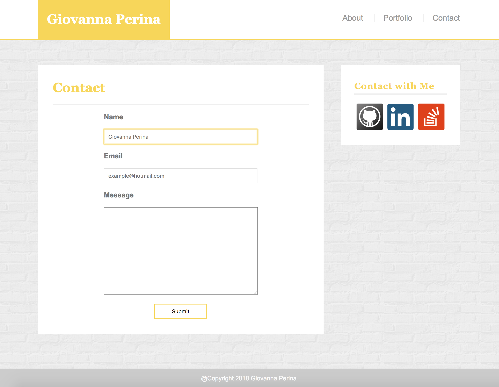

# Basic Portfolio

##  Overview

A professional portfolio site using HTML/CSS.

---
### Additional Information
- The background pattern used was found on [Subtle Patterns](https://www.toptal.com/designers/subtlepatterns/). 
- The website is responsive!

### Hover 
---
Simple hover effects.
<!--  -->

